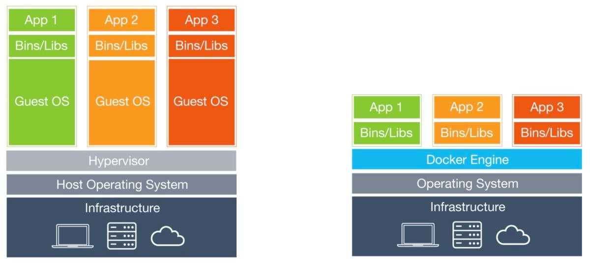

# Docker <!-- .element: class="r-fit-text" -->

Introduction

---

## Agenda

- What is Docker? <!-- .element: class="fragment fade-up" --->
- General concepts <!-- .element: class="fragment fade-up" --->
- Docker compose <!-- .element: class="fragment fade-up" --->
- Demo <!-- .element: class="fragment fade-up" --->

---

## What is Docker?

Docker is an OSS virtualization tool that helps in building isolated and lightweight environments.

Note:

- Docker can be used in production or development.
- Can be used to share some example that can run exactly the same on any OS.

---

## General concepts

---

#### General concepts

## Dockerfile

Dockerfile is a text document that contains instructions to build a docker image.

Note:

- A Dockerfile is a text file that Docker reads in from top to bottom.
- It contains a bunch of instructions which informs Docker HOW the Docker image should get built.
- This text file provides a set of instructions to build a Docker image, including the operating system,
  languages, environmental variables, file locations, network ports, and any other components it needs to run.

---

#### Dockerfile

##### Example

```dockerfile []
FROM scratch

ARG SHA1

ENV VERSION 0.0.1

EXPOSE 80

WORKDIR /app

COPY . .

RUN make build
RUN cp build/my-awesome-app /usr/bin/my-awesome-app

CMD my-awesome-app
```

Note:

- FROM — Select the base image to build the new image on top of.
- ARG - defines a variable that users can pass at build-time to the builder.
- ENV — Set/modify the environment variables within Containers created from the Image.
- EXPOSE — Define which Container ports to expose.
- WORKDIR - sets the working directory for any instructions that follow it in the Dockerfile.
- COPY - copies new files or directories from the host and adds them to the filesystem of the container at the path.
- RUN - will execute any commands in a new layer on top of the current image and commit the results.
- CMD — This is the command that will run when the Container starts.

---

#### General concepts

## Docker image

A file that contains instructions to build and execute docker containers.

Note:

- A Docker image is comparable to a virtual machine snapshot.
- They are portable, read-only, executable file containing the instructions for creating a container
  and the specifications for which software components the container will run and how.

---

#### General concepts

## Docker container

Is a self-contained unit of software that can run in a cloud server, in a giant bare-metal server or in your laptop.

Note:

- Containers are self-contained units of software
- it will run in the same way because it is isolated at the process level and has its own file system.

---

#### Docker container



Note:

- In the virtual machine (VM) world, this could be done by keeping applications separate while running on the same hardware,
  but in that world each VM requires its own operating system, meaning they are typically large, slow to start up,
  difficult to move around, and cumbersome to maintain and upgrade.
- Where containers marked a defined shift from the VM era was by isolating execution environments while sharing the underlying OS kernel, providing a lightweight and speedy option for developers.

---

#### General concepts

## Docker registry

A repository where Docker images can be stored, shared, and managed.

Note:

- Comparable to Github, but specifically for Docker images.

---

## Docker Engine

It is the underlying client-server technology that creates and runs the containers.

Note:

- Docker Engine is the core of Docker.
- The Docker Engine includes a long-running daemon process called dockerd for managing containers, APIs that allow
  programs to communicate with the Docker daemon, and a command-line interface.

---

#### Docker registry

## Example

- Docker hub
- Github packages
- Amazon Elastic Container Registry
- Gitlab Container Registry

---

## Docker compose

A command-line tool that uses YAML files to define and run multicontainer Docker applications

---

## Docker desktop

Provides a user-friendly way to build and share containerized applications and microservices.

Note:

- All of these component parts are wrapped in one application.

---

## Demo

---

## Thank you!
